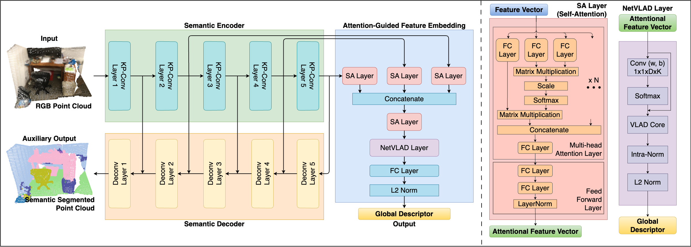

# Semantic Indoor Place Recognition

Repo will be cleaned up soon.




## Introduction

This repository contains the implementation of **AEGIS-Net** in [PyTorch](https://pytorch.org/).
 
AEGIS-Net is an indoor place recognitino network extended from our previous work [CGiS-Net](https://github.com/YuhangMing/Semantic-Indoor-Place-Recognition). It is a two-stage network that first learns a semantic encoder-decoder to extract semantic features from coloured point clouds, and then learns a feature embedding module to generate global descriptors for place recognition.

## Installation

This implementation has been tested on Ubuntu 18.04, 20.04 and 22.04. 

* For Ubuntu 18.04 installation, please see the instructions from the official KP-Conv repository [INSTALL.md](https://github.com/HuguesTHOMAS/KPConv-PyTorch/blob/master/INSTALL.md).

* For Ubuntu 20.04 and 22.04 installation, the procedure is basically the same except for different versions of packages are used.

    - Ubuntu 20.04: PyTorch 1.8.0, torchvision 0.9.0, CUDA 11.1, cuDNN 8.6.0
    
    - Ubuntu 22.04: PyTorch 1.13.0, torchvision 0.14.0, CUDA 11.7

## Experiments

### Data

The ScanNetPR dataset can be downloaded [here](https://drive.google.com/drive/folders/1F3jJ_iPJIMIl4Fr06ioVQq8fCVqqMDnP?usp=sharing)
```
├── ScanNetPR
│   ├── scans                              # folder to hold all the data
│   │   ├── scene0000_00
│   │   │   ├── input_pcd_0mean
│   │   │   │   ├── scene0000_00_0_sub.ply # zero meaned point cloud file stored ad [x, y, z, r, g, b]
│   │   │   │   ├── ...
│   │   │   ├── pose
│   │   │   │   ├── 0.txt                  # pose corresponding to the point cloud
│   │   │   │   ├── ...
│   │   │   ├── scene0000_00.txt           # scene information
│   │   ├── ...
│   ├── views/Tasks/Benchmark              # stores all the data split file from ScanNet dataset
│   ├── VLAD_triplets                      # stores all the files necessary for generating training tuples
├── batch_limits.pkl                       # calibration file for KP-Conv
├── max_in_limits.pkl                      # calibration file for KP-Conv
├── neighbors_limits.pkl                   # calibration file for KP-Conv
└── other ScanNet related files ...
```

### Training stage 1:

In the first stage we train the semantic encodes and decoder on a SLAM-Segmentation task, i.e. semantic segmentation on coloured point clouds within local coordinate system.

1. Change the `self.path` variable in the `datasets/ScannetSLAM.py` file to the path of complete ScanNet dataset.

2. Run the following to train the semantic encoder and decoder.
```
python train_ScannetSLAM.py
```

The training usually takes a day. We also provide our pretrained endocer-decoder [here](https://drive.google.com/drive/folders/1ClyEa7fygBkKZ5oEH-DQQYykj8RJJ51p?usp=sharing) if you want to skip the first training stage.

Please download the folder and put it in the `results` directory. In the folder `Log_2021-06-16_02-31-04` we provide the model trained on the complete ScanNet dataset WITHOUT colour. And in the folder `Log_2021-06-16_02-42-30` we provide the model trained on the compltete ScanNet dataset WITH colour.

### Training stage 2:

In the second stage, we train the feature embedding module to generate the global descriptors.

1. Change the `self.path` variable in the `datasets/ScannetTriple.py` file to the path of ScanNetPR dataset.

2. Run the the training file as:
```
python feature_embedding_main.py --train
```
Train the model with different setting:
- `--num_feat ` change the number of feature layers, default 3, choosing from [3, 1] for attention version, [1, 3, 5] for no attention version;
- `--optimiser` change the optimiser, default Adam, choosing from [SGD, Adam];
- `--loss` change the loss function, default lazy_quadruplet, choosing from [triplet, lazy_triplet, lazy_quadruplet];
- `--no_att` set to use no attention version;
- `--no_color` set to use point clouds without colour ;

### Evaluation:
Run the file with an additional --test flag on, perform evaluation with the --eval flag on:
```
python feature_embedding_main.py --test --evaluate --visualise
```

### Visualisations
* [Kernel Visualization](./doc/visualization_guide.md): Use the script from KP-Conv repository, the kernel deformations can be displayed.

### Results

Our AEGIS-Net is compared to a traditional baseline using SIFT+BoW, and 5 deep learning based method [NetVLAD](https://github.com/Nanne/pytorch-NetVlad), [PointNetVLAD](https://github.com/cattaneod/PointNetVlad-Pytorch), [MinkLoc3D](https://github.com/jac99/MinkLoc3D), Indoor DH3D and [CGiS-Net](https://github.com/YuhangMing/Semantic-Indoor-Place-Recognition).

| Model \ Recall           |   Top-1    |   Top-2    |   Top-3    | Epochs/Time Trained |  Device                 |
| *Our Models* |
| ACGiS-Net (default)      | **65.09%** | **74.26%** | **79.06%** | 20 epochs (4 days)  | NVIDIA GeForce RTX 4090 |
| ACGiS-Net (no attention) |   55.13%   |   66.19%   |   71.95%   | 20 epochs (4 days)  | NVIDIA GeForce RTX 4090 |
| *NOTE*: ACGiS-Net (no attention) = CGiS-Net (3 feats, using feat 2, 4, 5) |
| CGiS-Net (default)       |   56.82%   |   66.46%   |   71.74%   | 20 epochs (7 days)  | NVIDIA TITAN X          |
| CGiS-Net (default)       |   61.12%   |   70.23%   |   75.06%   | 60 epochs (21 days) | NVIDIA TITAN X          |
| *Comparisons from CGiS-Net Paper* |
| SIFT + BoW               |   16.16%   |   21.17%   |   24.38%   | -                   | -                       |
| NetVLAD                  |   21.77%   |   33.81%   |   41.49%   | -                   | NVIDIA TITAN X          |
| PointNetVLAD             |   5.31%    |   7.50%    |   9.99%    | -                   | NVIDIA TITAN X          |
| MinkLoc3D                |   3.32%    |   5.81%    |   8.27%    | -                   | NVIDIA TITAN X          |
| Indoor DH3D              |   16.10%   |   21.92%   |   25.30%   | -                   | NVIDIA TITAN X          |


## Acknowledgment

In this project, we use parts of the official implementations of following works:

* <a href="https://github.com/HuguesTHOMAS/KPConv-PyTorch">KP-FCNN</a> (Semantic Encoder-Decoder)

* <a href="https://github.com/cattaneod/PointNetVlad-Pytorch">PointNetVLAD-Pytorch</a> (NetVLAD Layer)

## Future Work
- [ ] Test on NAVER Indoor Localisation Dataset [Link](https://europe.naverlabs.com/blog/first-of-a-kind-large-scale-localization-datasets-in-crowded-indoor-spaces/).

- [ ] Test on other outdoor datasets (Oxford RobotCar Dataset etc.).

- [ ] Explore attention module for better feature selection before constructing global descriptors.
